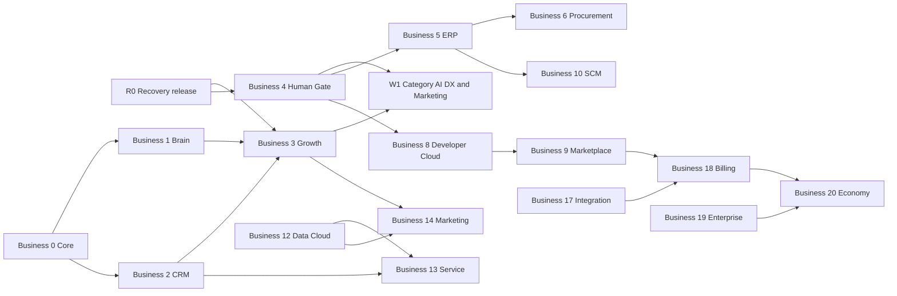

# 369 OS Phase Readiness Matrix v2

- Snapshot: 2026-07-12 JST
- Codex branch: `codex/phase-roadmap-audit-v2`
- Fixed recovery input: PR #14 `e03c678d07b0df31bc2553af1ed2fd46695cb625`
- Fixed code input: `b1cc686056c5dc5942f20b0a41f27ce725ff3011`
- Main observed: `ffd586b8cd87ec407aad6ecd3e0ea4394aee1978`
- Independent review: PR #14 review `4678311330`, `CHANGES_REQUIRED`
- Purpose: separate repository milestones, Business Phase 0-20, PDF Phase 2.5-18, Strategy Phase 18.5-26, and release readiness so that a narrow v0 close is never mistaken for completion of the full product phase.
- Ownership: this file belongs to Codex's complete-function-ledger scope. It does not edit or replace Claude-owned roadmap 80, audit 176, task state, application code, or package code.

## 1. Executive conclusion

The project is not simply "in Phase 4". The accurate current position is:

1. **Repository lineage:** historical narrow milestones through Phase 2-A/B/C were closed, while the current recovery is still Draft PR #14 and has a known High plus four additional unresolved review threads.
2. **Business roadmap:** Phase 3 Growth and Phase 4 Human Certification are partial. Business Phase 2, 5, 11, and the later phases are much broader than the repository milestones that used similar numbers.
3. **Local parallel workstreams:** `P35-CHANNELS` and `P4-WORKFORCE` are useful overlays, but neither is a replacement for Business Phase 4, whose canonical meaning is Human Certification Gate / safe AI execution.
4. **Release readiness:** `CHANGES_REQUIRED / HOLD`. Green CI at the reviewed head does not close the untested secret-mask oracle, stale-run mismatch, role-boundary mismatch, eight-person parity gap, or evidence overstatement.
5. **Long-term implementation:** the latest human direction is staged full implementation, starting after a safe release with category-by-category AI DX and Marketing. This direction is not yet a formal Stable ID and is recorded here as `UNMAPPED_CANDIDATE`, not invented as a new Function ID.

## 2. Why earlier "Phase complete" statements were confusing

The same numbers were used for different scopes.

| Name used in prior reports | What it actually closed | What it did not close |
|---|---|---|
| Repository Phase 1 / Phase X | A narrow implementation and quality milestone | Business Phase 0 or all platform/security requirements |
| Repository Phase 2-A/B/C | Company Brain vertical slices and related production records | Business Phase 2 Salesforce Mini in full, including CPQ, Service, Contact Center, Marketing Automation, Commerce, and BI |
| AI Growth Engine v0 close candidate | Control Tower, read boundaries, draft/read-only growth functions | All Business Phase 3 channels, external execution, full attribution, and production release |
| `P4-WORKFORCE` | AI employee read model, 3D Office, outcomes, lifecycle views | Business Phase 4 Human Certification Gate in full |
| Phase 3.5 | A local overlay for C19/C21/C22 growth channels | A phase defined in the original Business Phase 0-20 source |

From this snapshot onward, every report must show all four axes and the named workstream.

## 3. Evidence baseline

### 3.1 Complete-function-ledger denominator

| Measure | Verified count | Interpretation |
|---|---:|---|
| Categories | 50 | Product capability taxonomy |
| Category atomic functions | 2,553 | Category function denominator |
| Stable IDs | 7,485 | Includes category functions, source requirements, regions, candidates, rules, and user requirements; not a count of implemented features |
| Generated outputs | 60 | GitHub canonical outputs 3 plus Obsidian generated mirror 57 |
| Known source gap | C49 | Detailed Appendix A section is absent; completion cannot be judged |

### 3.2 Formal Evidence rows currently present

`FUNCTION_IMPLEMENTATION_EVIDENCE_V1.md` contains 47 rows:

| Evidence state | Rows |
|---|---:|
| `PARTIAL_PRODUCTION_EVIDENCE` | 9 |
| `VERIFIED_REPOSITORY` | 21 |
| `PARTIAL_LOCAL` | 10 |
| `DOCS_DEFINED` | 4 |
| `BLOCKED` | 2 |
| `SOURCE_DETAIL_MISSING` | 1 |

The 47 rows cover C03, C04, C07, C19, C21, C28, C30, C38, C46, C49, and nine USR requirements. This is **Evidence coverage**, not a 47/7,485 implementation percentage. Unlisted IDs remain `IMPLEMENTATION_UNVERIFIED`.

The Evidence file also predates the PR #14 independent review in several rows. Where it conflicts with fixed-SHA review evidence, the newer review controls the current Gate but does not silently rewrite the old Evidence row.

## 4. Status vocabulary

| Status | Meaning |
|---|---|
| `PARTIAL_PRODUCTION_EVIDENCE` | A specifically listed narrow function has production evidence; the full phase is not complete |
| `REPOSITORY_SURFACE_PRESENT` | Models/routes/components exist, but Function-ID acceptance evidence is incomplete |
| `DRAFT_IMPLEMENTED` | Implemented on a Draft branch only |
| `CI_VERIFIED` | Acceptance at one fixed SHA is covered by CI; not Preview/main/production |
| `CHANGES_REQUIRED` | A fixed-SHA review found a release-blocking defect or unmet acceptance condition |
| `IMPLEMENTATION_UNVERIFIED` | The implementation or its evidence has not been independently mapped |
| `ROADMAP_ONLY` | Requirement is retained for future implementation |
| `EVIDENCE_GAP` | A required proof is absent |
| `SOURCE_DETAIL_MISSING` | The source does not contain enough detail to judge completion |

## 5. Current four-axis position

| Axis | Current position | Evidence | Gate |
|---|---|---|---|
| Repository lineage | Recovery PR #14, head `e03c678`; code `b1cc686` | PR #14 and independent review | `CHANGES_REQUIRED` |
| Business Phase 0-20 | Phase 3 and Phase 4 partial; Phase 0-2 have narrow production slices, not full-phase proof | B18 source plus Evidence v1 | `HOLD` |
| PDF Phase 2.5-18 | Phase 2.5/3/4 partial; later phases roadmap-only | B16 source | `PARTIAL / HOLD` |
| Strategy Phase 18.5-26 | Requirements retained; no external platform/marketplace release proof | B17 source | `ROADMAP_ONLY` |
| Local workstreams | `P3-GROWTH`, `P35-CHANNELS`, `P4-WORKFORCE`, recovery release | roadmap 69/80 and PRs #3-#14 | recovery first |

## 6. Repository and release lineage

| Layer | Fixed ref | What is present | What is not proven |
|---|---|---|---|
| Production/main | `ffd586b` | 123 pages, 63 NAV; previously deployed production lineage | Four recovery routes and later stream work |
| Feature | `24782cc` | Phase 3 close candidate plus prior Codex Track A | Main/production integration |
| Integration PR #12 | `7ef2d9f` | Feature plus Streams A/B/C/D; 127 pages, 67 NAV | Main/production; latest recovery fixes |
| Recovery PR #14 | `e03c678` / code `b1cc686` | Security/recovery delta, AI profile links, nav contract, roadmap 80 | High/P2 closure, eight-agent proof, human Preview, main, production |
| Codex review | review `4678311330` | High 1, P2 2, parity/evidence and docs gaps | Closure at a newer Claude SHA |

Release order remains: Claude fixes PR #14 -> exact-head CI/artifacts -> Codex re-review -> human Preview -> explicit human GO -> a separate merge/production instruction.

## 7. Business Phase 0-20

The canonical names below come from B18. Status is conservative and applies to the **whole source phase**, not to isolated pages or tables.

| Phase | Canonical scope | Current evidence conclusion | Primary gap / next Gate |
|---:|---|---|---|
| 0 | Core OS / safety foundation | `PARTIAL_PRODUCTION_EVIDENCE` | Formal coverage for tenant/RBAC/audit/approval is sparse; do not equate the historical quality milestone with the whole phase |
| 1 | Company Brain foundation | `PARTIAL_PRODUCTION_EVIDENCE` | Narrow Brain sources are proven; all source types and department-wide ingestion are not |
| 2 | Salesforce Mini / CRM | `REPOSITORY_SURFACE_PRESENT / IMPLEMENTATION_UNVERIFIED` | Customer, Contact, Deal, Quote and CRM routes exist, but C08-C10/C26 phase-wide Evidence is absent; CPQ, Service, Contact Center, MA, Commerce and BI remain incomplete or unverified |
| 3 | AI Growth Engine | `DRAFT_IMPLEMENTED / CHANGES_REQUIRED` | v0 and C19/C21 drafts exist; formal Growth coverage, production release and safe approval connection remain open |
| 4 | Human Certification Gate / safe AI execution | `PARTIAL_FOUNDATION / CHANGES_REQUIRED` | Approval foundations exist, but double approval, risk/decision context, consent/compliance, kill switch, preview, post-action log, compensation, and safe resume are not proven end to end |
| 5 | Oracle Mini / ERP | `REPOSITORY_SURFACE_PRESENT / IMPLEMENTATION_UNVERIFIED` | Account, Journal, Invoice, Expense and finance routes exist; full accounting, AP/AR, closing, tax, fixed assets, reconciliation and Function-ID evidence do not |
| 6 | PLUG commerce / affiliate / procurement | `ROADMAP_ONLY` with partial adjacent surfaces | C22 is design-only; procurement and affiliate end-to-end flow is not proven |
| 7 | Commerce / EC / Order Management | `REPOSITORY_SURFACE_PRESENT / IMPLEMENTATION_UNVERIFIED` | Quote/invoice/inventory surfaces are not a complete order, payment, return, loyalty, POS or EC system |
| 8 | Developer Cloud | `ROADMAP_ONLY` | Internal agent components do not prove a developer portal, SDK/CLI, sandbox, manifest or certification platform |
| 9 | AI employee Marketplace | `ROADMAP_ONLY` | No reviewed distribution, pricing, review, install or revenue-share system |
| 10 | Oracle SCM / inventory / procurement | `REPOSITORY_SURFACE_PRESENT / IMPLEMENTATION_UNVERIFIED` | Inventory and purchase-order surfaces exist; demand planning, supplier/contract, full logistics and SCM Evidence are absent |
| 11 | HCM / recruiting / education / HR | `REPOSITORY_SURFACE_PRESENT / IMPLEMENTATION_UNVERIFIED` | Candidate model exists; employee master, attendance, payroll, labor procedures and phase evidence are absent |
| 12 | Data Cloud / BI / Analytics | `PARTIAL_DRAFT_EVIDENCE` | Some C28 dashboards are mapped; semantic model, data quality/freshness and unified KPI dictionary are not |
| 13 | Service Cloud / Contact Center / Customer Success | `REPOSITORY_SURFACE_PRESENT / IMPLEMENTATION_UNVERIFIED` | Communication/complaint surfaces do not prove case, SLA, omnichannel, NPS/CSAT or renewal workflows |
| 14 | Marketing Cloud | `DRAFT_IMPLEMENTED` for C19/C21 only | External accounts, attribution, MA, segmentation, shared agency dashboard and publishing remain sealed or unverified |
| 15 | Industry Cloud | `ROADMAP_ONLY` | Industry templates, KPIs, workflows, risks and validated vertical packages not established |
| 16 | Employee distribution platform | `ROADMAP_ONLY` | Employee app, private/company mode isolation and distribution evidence absent |
| 17 | External API / Integration Hub | `ROADMAP_ONLY` | Public/partner API, OAuth, webhook retry, registry and MCP remain gated |
| 18 | Billing / Metering / Revenue Share | `ROADMAP_ONLY` | UsageEvent is not real billing; invoice, settlement, developer payout and margin controls remain sealed |
| 19 | Enterprise Governance | `REPOSITORY_SURFACE_PRESENT / IMPLEMENTATION_UNVERIFIED` | Core RBAC/audit exists, but SSO, SCIM, enterprise RBAC, SIEM, DLP, retention, DR and enterprise assurance do not |
| 20 | 369 economy / AI employee OS | `ROADMAP_ONLY` | Depends on all preceding platform, marketplace, billing and governance Gates |

## 8. Local current workstreams

| Workstream | Relation to canonical phases | Current Gate | Exit condition |
|---|---|---|---|
| `RELEASE-RECOVERY` | Release overlay, not a Business Phase | `CHANGES_REQUIRED` | PR #14 High/P2 closed, exact-head CI/artifacts, Codex reviewed, human Preview |
| `P3-GROWTH` | Narrow Business Phase 3 v0 | `HOLD` | Formal Evidence mapping, release lineage, no unresolved High, human close decision |
| `P35-C19-ADS` | Local overlay; contributes to Business Phase 3/14 | `DRAFT` | Read-only/draft evidence plus human certification path; external execution remains sealed |
| `P35-C21-SEO` | Local overlay; contributes to Business Phase 3/14 | `DRAFT` | Read-only/draft evidence plus human certification path; publish remains sealed |
| `P35-C22-REFERRAL` | Local overlay; contributes to Business Phase 6/14 | `ROADMAP_ONLY` | Consent, attribution, disclosure and schema Gate before implementation |
| `P4-HUMAN-GATE` | Canonical Business Phase 4 | `PARTIAL / HOLD` | Safe decision/resume/compensation flow and role-negative evidence |
| `P4-WORKFORCE` | Parallel AI workforce workstream; contributes to C04/C30/C31 | `CHANGES_REQUIRED` at recovery | Eight-agent parity, lifecycle safety, work evidence, Preview and release proof |

## 9. PDF Phase 2.5-18

| PDF Phase | Source completion condition | Current conclusion |
|---|---|---|
| 2.5 Initial MVP | 5+ AI employees and operating logs | `DRAFT/PARTIAL`; eight profiles exist on recovery, but reviewed operating proof and production are absent |
| 3 Approval/audit | 100% audit and working approval flow | `PARTIAL`; approval/audit foundations exist, but 100% coverage and full decision flow are unverified |
| 4 Brain expansion | 20 ingestion targets and all-department flow | `PARTIAL_PRODUCTION_EVIDENCE`; narrow Brain sources are proven, not 20/all departments |
| 5 AI employee templates | 20+ reusable templates, library v1 | `ROADMAP_ONLY` |
| 6 Usage billing | automated metering through invoicing | `ROADMAP_ONLY`; usage events are not billing |
| 7 Fit-Gap Engine | automated diagnosis report | `ROADMAP_ONLY` |
| 8 External beta | five beta companies and NPS 40+ | `NOT_STARTED / no market evidence` |
| 9-10 GA | formal service, SLA 99.9%, 30 companies | `NOT_STARTED / no market evidence` |
| 11 Ecosystem | SDK and ten partners | `ROADMAP_ONLY` |
| 12-13 Studio/Builder | customer self-building adoption | `ROADMAP_ONLY` |
| 14 Self-evolution | weekly evidence-based improvement release | `ROADMAP_ONLY` |
| 15 Quality/trust | certification, DR, enterprise readiness | `REQUIREMENT_ONLY`; CI is not SOC 2/ISO/DR evidence |
| 16 Marketplace | distribution, review, payment and split | `ROADMAP_ONLY` |
| 18 Complete form | Apple-like management OS | `ROADMAP_ONLY` |

## 10. Strategy Phase 18.5-26

All B17 phases remain `ROADMAP_ONLY`: Runtime Standardization, Company Brain API Public, AI Employee Studio Template, Block Builder, SDK/Developer Portal, Safety Review/Certification, Marketplace Launch, Developer Ecosystem Expansion, and Open AI Workforce Economy.

Internal code with a similar name must not be promoted to these external strategy phases without public API, scope/audit, certification, distribution, market and production evidence.

## 11. Execution waves for the latest human direction

These waves do not renumber B18. They define a safe execution order.

| Wave | Goal | Business phases/categories | Required Gate |
|---|---|---|---|
| R0 | Safe recovery release | current P3/P4 drafts | PR #14 closure, Codex re-review, human Preview/GO |
| W1 | Category AI DX + Marketing | existing operational categories, C18-C22/C27/C28/C30 | read-only insight -> AI draft -> human decision -> sealed action -> outcome evidence |
| W2 | Complete CRM/SFA/Service foundations | Business 2 and 13; C08-C10/C26 | code-to-ledger audit, tenant/RBAC, data quality, no blind parity claim |
| W3 | Accounting/finance core | Business 5; C12-C15 | accounting domain audit, specialist boundaries, reconciliation, e-books/OCR/fixed assets staged |
| W4 | HR/labor/payroll | Business 11; C23-C25 | high-confidential design, human decisions, legal/specialist review |
| W5 | Commerce/procurement/SCM | Business 6/7/10; C15-C17/C22 | consent, disclosure, purchase approval, inventory/accounting integration |
| W6 | Data/service/marketing/verticals | Business 12-15 | semantic layer, outcome metrics, service/marketing evidence, industry validation |
| W7 | Employee/API/billing/enterprise | Business 16-19 | isolation, certification, public exposure review, real billing separate approval |
| W8 | Economy | Business 20 and Strategy 18.5-26 | marketplace, governance, revenue share and ecosystem evidence |

Latest direction requiring staged full implementation and W1 priority is `UNMAPPED_CANDIDATE` until the source-ledger revision process assigns or maps a formal ID.

## 12. Dependency graph

## 13. Critical path

1. **Release blocker:** PR #14's fixed High, stale-active mismatch, role boundary, eight-person parity, and docs evidence must be closed at a newer exact SHA.
2. **Independent Gate:** Codex must re-review that SHA; green CI alone is insufficient.
3. **Human Gate:** the user must inspect the authenticated Preview and explicitly approve release. No action is required while Claude is still repairing the branch.
4. **Business Phase 4:** after recovery, connect one low-risk Growth draft to a real human decision/resume record while keeping external publish/send/budget actions sealed.
5. **Full-function program:** audit existing CRM, accounting and HR code against the ledger before implementing duplicates. Existing pages/models are surface evidence, not parity.
6. **Platform exposure:** API, MCP, marketplace, billing and external developer functions remain downstream of certification and enterprise governance.

## 14. Next three executable WIPs

| Order | WIP | Owner | Scope | Acceptance | Parallel rule |
|---:|---|---|---|---|---|
| 1 | `R0-DEFECT-CLOSE` | Claude implementation; Codex later review | Close the five PR #14 threads and produce exact-head evidence | Critical 0, High 0, required P2/evidence tests, CI/artifacts | Claude owns code and roadmap80; Codex does not edit them |
| 2 | `R0-INDEPENDENT-GATE` | Codex + human | Re-review the new SHA, inspect artifacts, dry-run release lineage, then human Preview | Codex reviewed, no unresolved High, correct build SHA, explicit human GO | Starts only after Claude posts a new fixed SHA |
| 3 | `P4-C21-HUMAN-CERT-V0` | Claude after a separate Gate | SEO brief draft -> human decision -> immutable decision/outcome record; no CMS publish | tenant/RBAC/consent, approve/reject/return, safe resume semantics, external action absent | Begins after R0; Codex reviews fixed delta |

`P4-C21-HUMAN-CERT-V0` is preferred over Agent Studio as the immediate product WIP because it closes the canonical Business Phase 4 dependency and satisfies the first category AI DX/Marketing path with lower external risk.

## 15. Additional Codex-only parallel work available

Without touching Claude's implementation, Codex can next perform:

1. `C08-C15` CRM/accounting code-to-ledger audit to distinguish existing surfaces from missing functions.
2. `C23-C24` HR/labor gap audit, including high-confidential and human-decision boundaries.
3. Exact-head PR #14 re-review as soon as Claude posts `CODEX_REVIEW_REQUEST_V63`.
4. Evidence update proposal for the latest staged-full-implementation requirement without inventing an ID.

## 16. Human actions

### Now

No action is required while Claude is implementing and Codex is auditing. Do not issue main/Production GO yet.

### Later

1. Wait for Claude's new fixed SHA and Codex's re-review verdict.
2. Open the exact Preview URL and confirm the displayed short SHA.
3. Check 67 navigation routes, AI employee list/detail/3D parity, desktop/mobile layout, and no missing functions.
4. Give an explicit GO only if the Evidence Pack has no unresolved Critical/High.

Schema changes, external sends, real LLM, payments, production data migration, public API/MCP, and billing require separate approvals.

## 17. Update protocol

1. Never overwrite this snapshot to make an old result look current. Add a dated refresh section or v3.
2. Fix all repository/CI/artifact claims to a SHA.
3. Keep requirement, repository, test, CI, Preview, main and production as separate columns.
4. Do not calculate subjective completion percentages. Use passed Gate counts only when the denominator is explicit.
5. Do not resolve `IMPLEMENTATION_UNVERIFIED` by assuming absence or completion; perform a code-to-ledger audit.
6. Do not use `NOT_PLANNED` for functions the human has retained for staged implementation.
7. Do not claim zero vulnerabilities, full competitor parity, or global leadership without defined comparison evidence.

## 18. Sources

- `docs/function-master/COMPLETE_FUNCTION_LEDGER_V1.json`
- `docs/function-master/SOURCE_MANIFEST_V1.json`
- `docs/function-master/FUNCTION_IMPLEMENTATION_EVIDENCE_V1.md`
- Appendix B B15, B16, B17 and B18 in the canonical ledger
- `docs/roadmap/58_complete_function_ledger_v1_canonicalization_candidate.md`
- `docs/roadmap/69_bplus_parallel_roadmap_canonicalization_candidate.md`
- `docs/roadmap/80_master_roadmap_4axis_and_competitor_matrices_v61.md`
- PRs #3, #4, #5, #6, #9, #12, #13 and #14
- PR #14 independent review `4678311330`

This document authorizes no merge, deployment, database operation, external send, real LLM, payment, or production action.
